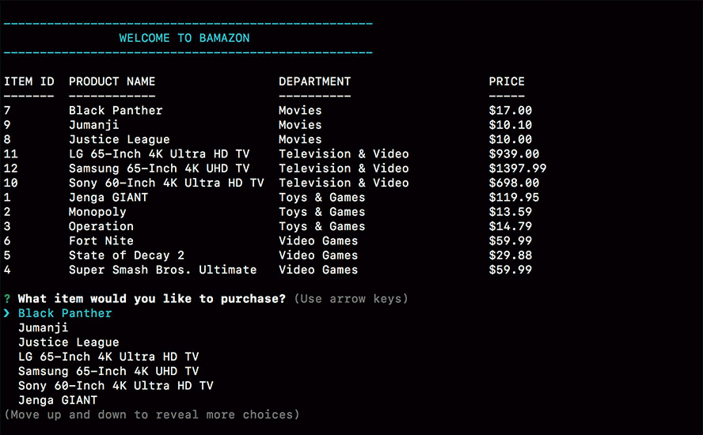
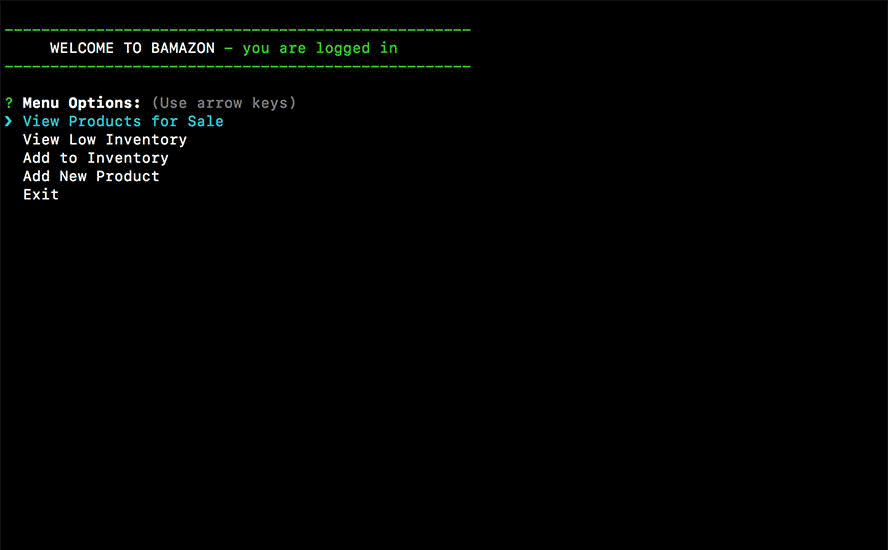

# bAmazon

Welcome to bAmazon. This application has 3 parts. You can view the store either as a customer, a manager, or a supervisor. The following is a breakdown of how to use the app as each type of user.

## Customer

To log in as a customer, type the following in the command line:

node bamazonCustomer.js

1. When you first log in, you will be presented with a list of all available products for sale along with their prices and department.

2. You will then be asked what you would like to purchase and given a list of items to choose from.

3. After choosing an item, you will be asked how many units you would like to buy.

4. After entering how many units you would like to buy, the purchase will be successful if there is enough stock available.

5. If there is enough stock to accommodate your purchase, you will be shown your order total and notified that you will receive an e-mail confirmation when your order ships.

6. If there is not enough stock, you will be given a message saying "Sorry! Insufficient Quantity" and then asked if you would like to purchase another item.

7. If you answer yes, you will be presented with the list of available products again and asked what you would like to purchase.

8. If you answer no, the application ends and you exit the system.

## Manager

To log in as a manager, type the following in the command line:

node bamazonManager.js

1. When you first log in, you will be presented with a list of menu options to choose from.

  - **View Products for Sale -** choosing this option will display all items available for sale.

  - **View Low Inventory -** choosing this option will display all items with an inventory count lower than 5.

  - **Add to Inventory -** choosing this option will allow the manager to "add more" of any existing item in the store.

  - **Add New Product -** choosing this option will allow the manager to add a completely new product to the store.

  - **Exit -** this option exits the system.

2. After each option, the manager will be asked what they would like to do next and shown the same list of items to choose from.

## Supervisor

To log in as a supervisor, type the following in the command line:

node bamazonSupervisor.js

1. When you first log in, you will be presented with a list of menu options to choose from.

  - **View Product Sales by Department -** choosing this option will display all categories along with their overhead costs, product sales, and total profit.

  - **Create New Department -** this option allows the supervisor to add departments to the system.

  - **Exit -** this option exits the system.